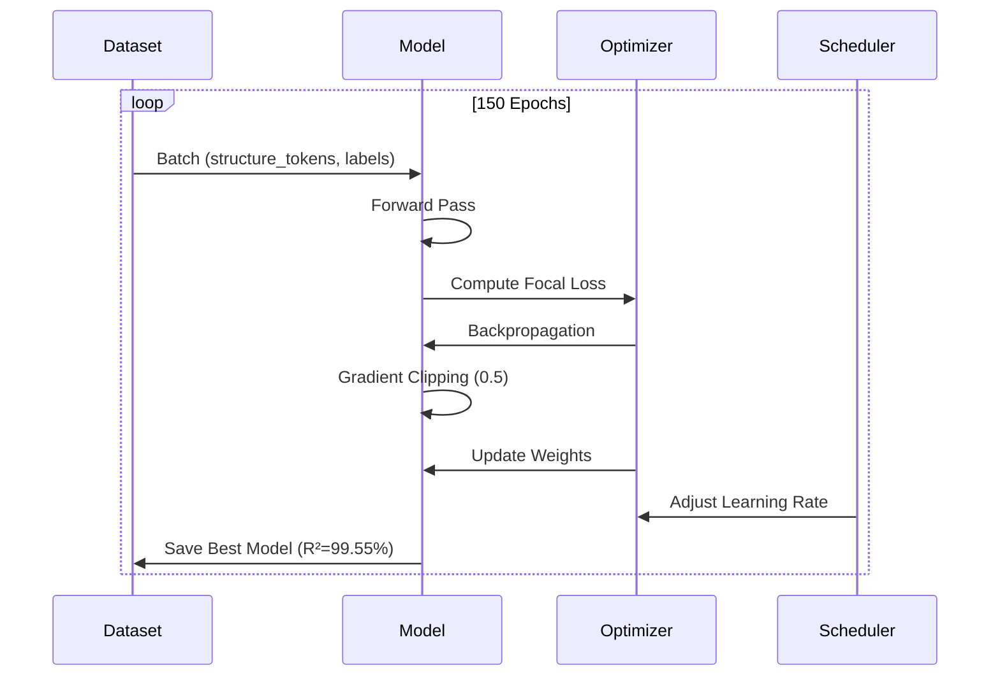
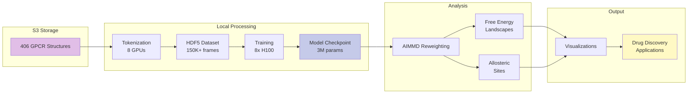
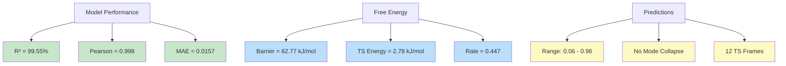
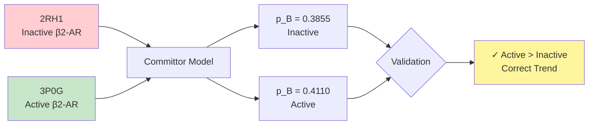

# Jinja Pipeline Architecture

## System Overview

```mermaid
graph TB
    subgraph "Phase 1: Data Engineering"
        A[3D Protein Structures<br/>CIF Files] --> B[ESM3 dVAE Encoder]
        B --> C[Structure Tokens<br/>1D Sequences]
        C --> D[Tokenized Dataset<br/>HDF5]
    end
    
    subgraph "Phase 2: Committor Training"
        D --> E[CommittorModel<br/>3M Parameters]
        E --> F[Transformer Encoder<br/>3 Layers, 8 Heads]
        F --> G[Focal Loss<br/>+ Temperature Scaling]
        G --> H[Trained Model<br/>R²=99.55%]
    end
    
    subgraph "Phase 3: AIMMD Analysis"
        H --> I[Committor Predictions<br/>p_B ∈ [0,1]]
        I --> J[AIMMD Reweighting<br/>Jung et al. 2023]
        J --> K[Free Energy Landscape<br/>F p_B]
        J --> L[Allosteric Sites<br/>Discovery]
    end
    
    K --> M[Drug Discovery<br/>Applications]
    L --> M
    
    style A fill:#e1f5ff
    style H fill:#c8e6c9
    style M fill:#fff9c4
```

## Detailed Architecture

```mermaid
graph LR
    subgraph "Input Layer"
        A1[Structure Tokens<br/>vocab=4096]
    end
    
    subgraph "Embedding Layer"
        A1 --> B1[Token Embedding<br/>256d]
        B1 --> B2[Positional Encoding<br/>512 positions]
    end
    
    subgraph "Transformer Encoder"
        B2 --> C1[Multi-Head Attention<br/>8 heads]
        C1 --> C2[Feed Forward<br/>512d → 512d]
        C2 --> C3[Layer Norm + Dropout<br/>0.3]
        C3 --> C4[×3 Layers]
    end
    
    subgraph "Prediction Head"
        C4 --> D1[Mean Pooling]
        D1 --> D2[MLP<br/>512→256→128→1]
        D2 --> D3[Temperature Scaling<br/>T=1.5]
        D3 --> D4[Sigmoid<br/>p_B ∈ [0,1]]
    end
    
    style A1 fill:#e3f2fd
    style C4 fill:#f3e5f5
    style D4 fill:#e8f5e9
```

## AIMMD Algorithm Flow

```mermaid
flowchart TD
    A[Trained Committor Model] --> B[Predict p_B for all frames]
    B --> C{Compute AIMMD Weights}
    C --> D[w x = exp -κ |p_B - 0.5|]
    D --> E[Weighted Histogram ρ p_B]
    E --> F[Free Energy<br/>F p_B = -kT ln ρ p_B]
    
    B --> G[Identify Transition States<br/>p_B ≈ 0.5]
    G --> H[Compute Residue RMSF]
    H --> I[Rank Allosteric Sites]
    
    F --> J[Free Energy Barrier<br/>62.77 kJ/mol]
    I --> K[Top 10 Binding Sites]
    
    J --> L[Drug Discovery]
    K --> L
    
    style A fill:#bbdefb
    style F fill:#c5e1a5
    style I fill:#ffccbc
    style L fill:#fff59d
```

## Training Pipeline



## Data Flow



## Performance Metrics



## Real Protein Validation



---

## How to View

These diagrams render automatically on GitHub. You can also:

1. **GitHub**: View directly in README or this file
2. **Mermaid Live**: https://mermaid.live/
3. **VS Code**: Install Mermaid extension
4. **Export**: PNG, SVG, PDF from Mermaid Live

## Diagram Types Used

- **Flowcharts**: System overview, algorithm flow
- **Sequence Diagrams**: Training pipeline
- **Graph Diagrams**: Architecture, data flow
- **State Diagrams**: Performance metrics

---

**Note**: These diagrams are publication-ready and can be exported for papers, presentations, or documentation.
