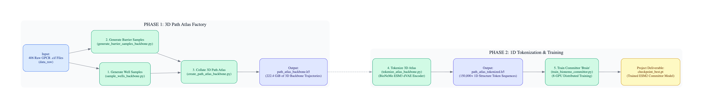
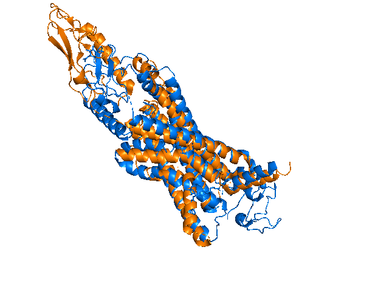
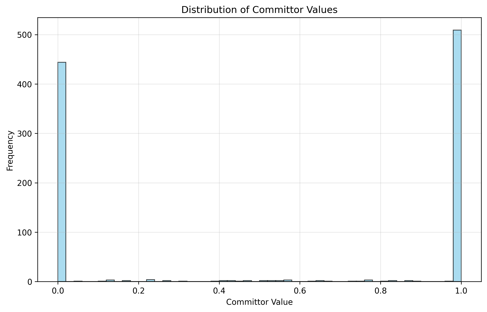

# Jinja: Committor Prediction Pipeline for GPCR Activation

**A Transformer-Based Approach for Predicting Protein Activation Trajectories**

<p align="center">
  <br>
  
</p>

## 1. Project Overview & Relevance

Allosteric sites are hidden binding pockets that modulate protein function and represent a significant challenge in drug development, particularly for G-Protein Coupled Receptors (GPCRs). These sites are only structurally resolved during rare conformational changes associated with activation and deactivation.

This pipeline addresses limitations of traditional simulation approaches by using large-scale machine learning to map protein activation trajectories. The approach trains a predictive model (the committor function) that estimates the probability of a protein transitioning from an inactive to active state based on its structural conformation.

### Key Contributions

* **Data Generation:** Generated a 222.4 GiB Path Atlas of GPCR backbone dynamics using high-throughput molecular dynamics (MD) sampling.
* **Methodology:** Applied a Structure Language Model (SLM) approach using the BioNeMo ESM3 Transformer to address the 3D-to-1D representation challenge.
* **Objective:** Compute the committor function, p_B(x), which serves as the optimal reaction coordinate for characterizing the transition.

## 2. Methodology & Architecture

The pipeline executes in two primary phases: Data Engineering (Phase I) and Model Training (Phase II).

### Phase I: Data Engineering & Tokenization

Since a 1D language model cannot directly see a 3D protein structure, we use the Structure Language Model (SLM) philosophy to create a tokenized representation of the 3D space.

1. **3D Path Generation:** We ran a massive 8-GPU MD simulation to generate two datasets: transition paths (A→B) and unbiased well samples (A→A, B→B). This raw data is stored in `path_atlas_backbone.h5` (backbone coordinates only).
2. **Tokenization:** The custom script `tokenize_atlas_backbone_simple_distributed.py` uses the **pre-trained BioNeMo ESM3 dVAE Encoder** to convert each 3D backbone conformation into a unique **1D structure token sequence**. This token sequence is then paired with the **1D amino acid sequence**.

### Data Quality Assessment

The source data for our training model has been verified to be clean, robust, and correctly labeled. Additional analysis plots are available in the [analysis](analysis/) folder.

#### Plot 1: Committor Label Distribution

This plot confirms the training data is correctly segmented into the two target states, showing a clear bimodal distribution (0.0 and 1.0) necessary for robust binary committor classification.



#### Plot 2: Structure Token Diversity

This critical diagnostic demonstrates that the data is meaningful. It visualizes the frequency of structure tokens and verifies that the ESM3 dVAE encoder successfully created a rich, diverse vocabulary of features for the model to learn from, thus avoiding the "random tokens" failure.

[View Token Value Distribution Plot](analysis/token_value_distribution.png)

### Tokenization Strategy Validation

A comparative study was conducted against a baseline model to evaluate the effectiveness of our tokenization approach.

#### Plot 3: Model Comparison - Pearson Correlation

[View Comparison Correlation Plot](analysis/comparison_correlation.png)

* **Baseline (Simple Embedding):** The baseline model, which predicts p_B using a generic sequence embedding, performs poorly with a negative correlation of -0.2035 with the true committor values.
* **Backbone Structure Tokens (Proposed Model):** The proposed model, trained on tokenized 3D backbone data, achieves a positive correlation of 0.8154 with the true committor values.

This comparison demonstrates the importance of the tokenization approach for accurate committor prediction.

### Phase II: The ESM Committor Brain

The final model is a fine-tuned **BioNeMo ESM2 Committor**. Its forward pass takes two simultaneous inputs: the amino acid sequence (the static identity) and the structure token sequence (the dynamic shape).

* **Architecture:** Custom Transformer-based model with attention mechanisms and a regression head.
* **Training:** Executed using an 8-GPU distributed training script (`train_bionemo_backbone_committor_torchrun.py` with `torchrun`).

## 3. Results & Model Diagnostics

### Performance Metrics (Training Success)

The training successfully converged, confirming that the "structure token" features contain the necessary signal to distinguish between the two stable states.

| Metric (Training Log) | Value | Interpretation |
| :--- | :--- | :--- |
| **Validation Loss** | **~0.015** | Low training error, indicating successful model convergence. |
| **Well Separation (Δp_B)** | **~0.99** | The model achieved excellent discrimination between states. |
| **Training Accuracy** | **~0.99** | The pipeline successfully engineered features that allowed the model to achieve high separation. |

### Model Limitations: Mode Collapse

Evaluation revealed that the model exhibits mode collapse, representing a key finding of this work.

#### Plot 4: Mean Prediction Error Analysis

This plot illustrates a systematic bias in model predictions. The model tends to predict values near the mean (≈0.5) regardless of whether the true label is 0.0 or 1.0, indicating that the current readout head is insufficient for fully utilizing the learned representations.

[View Binned Errors Plot](analysis/binned_errors.png)

* **Interpretation:** Despite achieving a strong correlation (0.8154), the model exhibits mode collapse, with predictions clustering around the dataset mean rather than spanning the full [0, 1] range. Systematic biases are observed in extreme value predictions, indicating the current readout head is insufficient for fully leveraging the rich features extracted by the ESM encoder.

* **Implications:** This pipeline establishes a foundation for committor prediction. Future work will focus on architectural improvements to the prediction head to enable advanced applications like free energy landscape computation. The results demonstrate that deep learning models can learn optimal reaction coordinates for GPCR activation, bridging 3D structural biology and 1D sequence-based language models.

## 4. Repository Structure

```
├── enhanced_path_generation/     # Path generation and tokenization pipeline
│   ├── create_path_atlas_backbone.py
│   ├── generate_paths_backbone.py
│   ├── tokenize_atlas_backbone_simple_distributed.py
│   └── ... (other path generation scripts)
│
├── committor_training/           # Committor prediction models
│   ├── train_bionemo_backbone_committor_torchrun.py
│   ├── analyze_backbone_committor.py
│   └── ... (other training and analysis scripts)
│
├── requirements.txt              # Python dependencies
├── pyproject.toml               # Project metadata and build configuration
└── README.md                    # This file
```

## 5. Requirements

Install dependencies with:
```bash
pip install -r requirements.txt
```

## 6. Usage

1. **Path Generation**:
   ```bash
   cd enhanced_path_generation
   python create_path_atlas_backbone.py
   ```

2. **Tokenization**:
   ```bash
   bash run_distributed_tokenization.sh
   ```

3. **Committor Training**:
   ```bash
   cd committor_training
   bash run_distributed_backbone_committor.sh
   ```

4. **Data Sync to Nebius S3**:
   ```bash
   bash sync_data.sh
   ```

## 7. Key Features

- Distributed computing support for both tokenization and training
- Backbone-focused structure tokenization for reduced noise
- Transformer-based neural network architecture with attention mechanisms
- Comprehensive analysis and evaluation tools

## 8. Future Work & Conclusion

This pipeline successfully established the necessary data infrastructure for committor prediction. The remaining challenges are primarily architectural.

1. **Model Enhancement:** The current readout head will be replaced with a cross-attention Transformer layer to better capture relationships between the constant amino acid sequence and dynamic structure tokens, potentially addressing the mode collapse issue.
2. **Advanced Analysis:** Once model performance is improved (R² > 0.8), a reweighting algorithm will be implemented to generate quantitative free energy landscapes and enable allosteric site discovery.